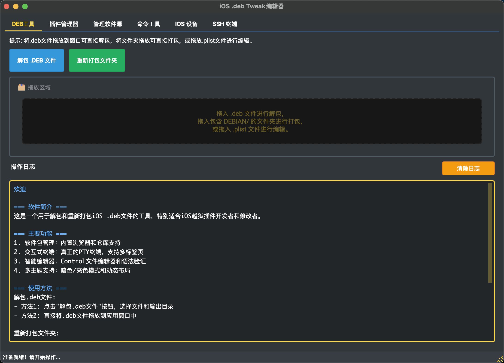
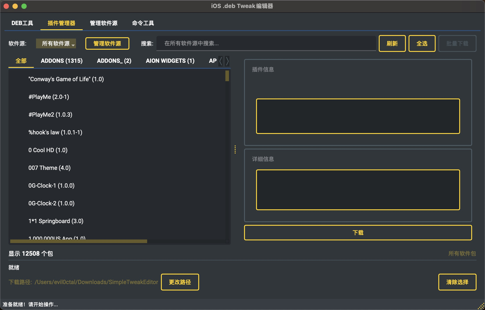
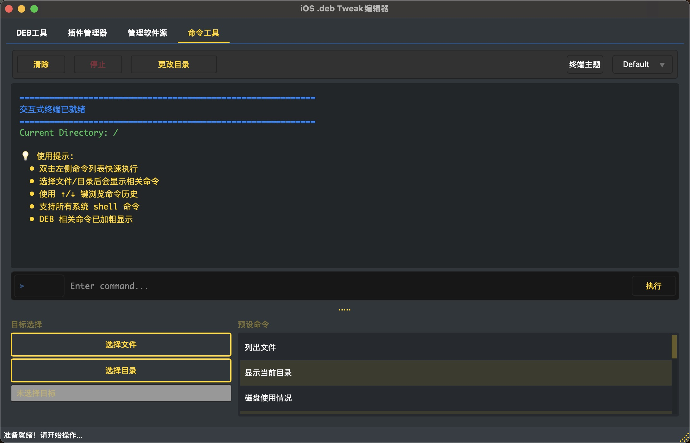
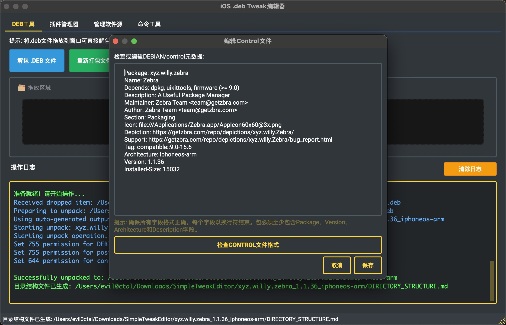
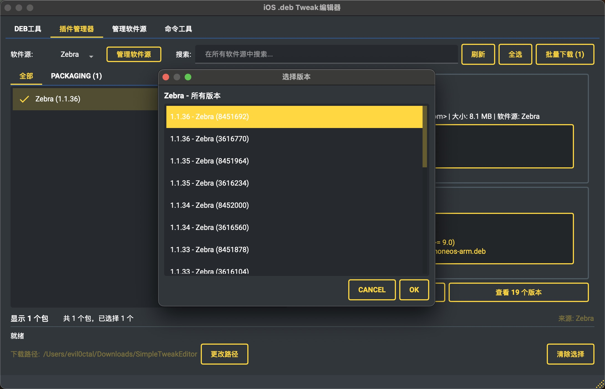
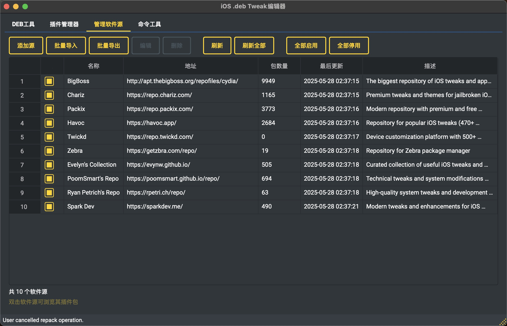

# SimpleTweakEditor

<div align="center">


[](LICENSE)
[](https://www.python.org/)
[](https://pypi.org/project/PyQt6/)
[](https://github.com/Evil0ctal/SimpleTweakEditor)
[](https://github.com/Evil0ctal/SimpleTweakEditor/stargazers)
[](https://github.com/Evil0ctal/SimpleTweakEditor/releases)
[](https://github.com/Evil0ctal/SimpleTweakEditor/releases/latest)

**专业的iOS .deb文件编辑工具 - 全平台支持，无需依赖**

🚀 **一键解包/重打包** | 🎯 **智能Control编辑** | 🌍 **跨平台运行** | 📦 **包管理器集成**

[English](README_EN.md) | [快速开始](docs/QUICK_START.md) | [下载](https://github.com/Evil0ctal/SimpleTweakEditor/releases)

</div>

## 📸 界面预览 / Screenshots

<div align="center">
<table>
  <tr>
    <td align="center">
      
      <br>
      <sub><b>主界面</b></sub>
    </td>
    <td align="center">
      
      <br>
      <sub><b>软件包管理器</b></sub>
    </td>
    <td align="center">
      
      <br>
      <sub><b>交互式终端</b></sub>
    </td>
  </tr>
  <tr>
    <td align="center">
      
      <br>
      <sub><b>Control文件编辑器</b></sub>
    </td>
    <td align="center">
      
      <br>
      <sub><b>软件包版本选择</b></sub>
    </td>
    <td align="center">
      
      <br>
      <sub><b>仓库管理器</b></sub>
    </td>
  </tr>
</table>
</div>

## 🎯 核心功能

### 📦 .deb包处理
- **一键解包** - 拖放.deb文件即可解压，保留完整目录结构和权限信息
- **智能重打包** - 自动验证包结构，确保生成的.deb文件符合Debian标准
- **跨平台支持** - Windows/macOS/Linux全平台运行，Windows下无需安装dpkg
- **批量操作** - 支持命令行批处理模式，高效处理多个包文件

### 📝 Control文件编辑器
- **语法高亮** - 专为Control文件优化的语法高亮显示
- **实时验证** - 编辑时实时检查字段格式和依赖关系
- **智能提示** - 自动补全包名、版本号等信息
- **模板支持** - 内置常用Control文件模板

### 📱 软件包管理器
- **多源支持** - 集成BigBoss、Chariz、Packix等主流iOS软件源
- **包浏览器** - 按分类浏览和搜索数千个iOS插件包
- **版本管理** - 查看包的所有历史版本，支持下载特定版本
- **离线缓存** - 智能缓存包信息，加快加载速度

### 💻 交互式终端
- **真实PTY** - 完整的伪终端实现，支持颜色和特殊字符
- **多标签页** - 同时运行多个终端会话
- **命令预设** - 常用dpkg/apt命令快捷按钮
- **历史记录** - 保存命令历史，支持快速重复执行

### 🎨 界面与体验
- **现代UI设计** - 基于PyQt6的原生界面，流畅美观
- **深色/浅色主题** - 支持系统主题自动切换
- **多语言支持** - 中英文界面，自动检测系统语言
- **拖放操作** - 支持文件拖放，操作更直观
- **状态保存** - 记住窗口位置、大小和用户偏好

### 🔐 安全特性
- **路径保护** - 防止路径遍历和符号链接攻击
- **大小限制** - 限制处理文件大小，防止内存溢出
- **权限管理** - 正确处理Unix文件权限，即使在Windows上
- **完整性校验** - 验证包结构完整性，防止损坏的包

## 安装 / Installation

### 系统要求 / System Requirements
- Python 3.8+
- PyQt6
- dpkg-deb（Linux/macOS，Windows下使用内置纯Python实现）

### 安装步骤 / Setup

```bash
# 克隆仓库 / Clone repository
git clone https://github.com/Evil0ctal/SimpleTweakEditor.git
cd SimpleTweakEditor

# 创建虚拟环境 / Create virtual environment
python3 -m venv venv
source venv/bin/activate  # Windows: venv\Scripts\activate

# 安装依赖 / Install dependencies
pip install -r requirements.txt

# macOS用户安装dpkg / macOS users install dpkg
brew install dpkg

# Linux用户安装dpkg / Linux users install dpkg
sudo apt-get install dpkg

# Windows用户无需额外安装 / Windows users need no additional setup
# 程序自动使用内置纯Python dpkg实现
```

## 🚀 快速开始

### 下载预构建版本（推荐）

从 [Releases](https://github.com/Evil0ctal/SimpleTweakEditor/releases) 下载适合你系统的版本：

| 平台 | 文件名 | 说明 |
|------|--------|------|
| **Windows** | `SimpleTweakEditor-v1.0.2-Windows-x64.zip` | 解压即用，无需安装 |
| **macOS Intel** | `SimpleTweakEditor-v1.0.2-macOS-x64.zip` | Intel芯片Mac |
| **macOS Apple Silicon** | `SimpleTweakEditor-v1.0.2-macOS-Apple-Silicon.zip` | M1/M2/M3芯片Mac |
| **Linux** | `SimpleTweakEditor-v1.0.2-Linux-x64.zip` | 支持大多数Linux发行版 |

#### 从源代码运行 / Run from Source
```bash
python main.py
```

### 使用方法

#### GUI模式（图形界面）
1. 双击运行程序
2. 拖放.deb文件到主窗口即可解包
3. 编辑文件后点击"重新打包"按钮

#### 命令行模式
```bash
# 解包.deb文件
python main.py --unpack package.deb --output ./unpacked/

# 重新打包文件夹
python main.py --repack ./package_folder/ --output package_new.deb

# 批量解包
python main.py --batch --unpack "*.deb"

# 设置界面语言
python main.py --lang zh  # 中文
python main.py --lang en  # English
```

## 🛠️ 工作原理

### Windows平台.deb处理
本工具在Windows上使用纯Python实现的dpkg功能，无需安装WSL或其他Linux工具：
- 完整实现AR归档格式解析
- 支持gz/xz/lzma等所有压缩格式
- 智能处理Unix文件权限映射
- 自动识别并设置可执行文件权限

### 智能权限处理
在Windows环境下创建的.deb包会自动设置正确的Unix权限：
- DEBIAN脚本文件（preinst/postinst等）: 755
- 二进制可执行文件: 755
- 普通文件: 644
- 目录: 755

## 项目结构 / Project Structure

```
SimpleTweakEditor/
├── main.py                    # 程序入口 / Main entry
├── requirements.txt           # 依赖列表 / Dependencies
├── README.md                 # 本文件 / This file
├── README_EN.md             # 英文文档 / English docs
├── RELEASE_NOTES.md         # 发布日志 / Release notes
├── LICENSE                   # 许可证 / License
├── docs/                     # 文档目录 / Documentation
│   ├── PROJECT_STRUCTURE.md  # 详细架构文档 / Architecture docs
│   ├── QUICK_START.md        # 快速开始指南 / Quick start guide
│   ├── FEATURE_ROADMAP.md    # 功能路线图 / Feature roadmap
│   ├── REPO_MANAGER_GUIDE.md # 仓库管理指南 / Repo manager guide
│   └── THEMES.md             # 主题说明 / Theme documentation
│
├── src/                      # 源代码 / Source code
    ├── core/                 # 核心模块 / Core modules
    │   ├── app.py           # 主应用逻辑 / Main app logic
    │   ├── config.py        # 配置管理 / Config management
    │   ├── events.py        # 事件定义 / Event definitions
    │   └── repo_manager.py  # 仓库管理 / Repository management
    │
    ├── ui/                   # 用户界面 / User interface
    │   ├── main_window.py   # 主窗口 / Main window
    │   ├── control_editor.py # Control编辑器 / Control editor
    │   ├── about_dialog_improved.py # 关于对话框 / About dialog
    │   ├── interactive_terminal.py # 交互式终端 / Interactive terminal
    │   ├── package_browser_dialog.py # 软件包浏览器 / Package browser
    │   ├── package_manager_widget.py # 软件包管理器 / Package manager
    │   ├── repo_manager_dialog.py # 仓库管理对话框 / Repo manager dialog
    │   └── styles.py        # 样式管理 / Style management
    │
    ├── workers/              # 后台任务 / Background tasks
    │   ├── command_thread.py # 命令执行 / Command execution
    │   └── download_thread.py # 下载任务 / Download tasks
    │
    ├── utils/                # 工具函数 / Utilities
    │   ├── file_operations.py # 文件操作 / File operations
    │   ├── dpkg_deb.py      # 跨平台dpkg实现 / Cross-platform dpkg
    │   └── system_utils.py  # 系统工具 / System utilities
    │
    ├── localization/        # 多语言 / Localization
    │   ├── language_manager.py # 语言管理 / Language manager
    │   └── translations.py  # 翻译数据 / Translation data
    │
    ├── resources/           # 资源文件 / Resources
    │   └── default_repositories.json # 默认软件源 / Default repositories
    │
    └── utils/               # 工具函数 / Utilities
        ├── file_operations.py # 文件操作 / File operations
        └── system_utils.py  # 系统工具 / System utilities
│
├── build.py                 # 通用构建脚本 / Universal build script
│
└── releases/                # 发布文件 / Release files
    └── vX.X.X/             # 版本发布目录 / Version release directory
        ├── Windows/        # Windows版本 / Windows builds
        ├── Darwin/         # macOS版本 / macOS builds
        └── Linux/          # Linux版本 / Linux builds
```

## 开发指南 / Development Guide

### 🔨 构建发布 / Building Releases

```bash
# 一键构建当前平台版本
python build.py
```

自动生成对应平台的可执行文件到 `releases/` 目录

### 代码质量 / Code Quality
- 遵循PEP 8规范
- 使用类型提示（准备中）
- 完整的错误处理
- 安全第一的设计理念

### 添加新功能 / Adding Features
1. 文件操作添加到 `utils/file_operations.py`
2. UI组件添加到 `ui/` 目录
3. 后台任务继承 `CommandThread` 类
4. 翻译添加到 `translations.py`

### 贡献指南 / Contributing
1. Fork本仓库
2. 创建功能分支 (`git checkout -b feature/AmazingFeature`)
3. 提交更改 (`git commit -m 'Add some AmazingFeature'`)
4. 推送到分支 (`git push origin feature/AmazingFeature`)
5. 创建Pull Request

## 📋 更新日志

### 🆕 v1.0.2 (2025-05-30) - Windows全面支持与终端增强
**重大更新：完整的Windows支持和交互式终端修复！**
- 🪟 **Windows原生支持** 
  - 纯Python实现dpkg功能，无需WSL或Cygwin
  - 支持Windows 10/11所有版本
  - 自动处理路径分隔符和权限映射
- 🐛 **交互式终端修复**
  - 修复在Linux/macOS上找不到dpkg的问题
  - 交互式终端现在在Windows上使用内置Python dpkg实现
  - 解决Windows终端中文显示乱码问题
  - 为Windows提供适配的快捷命令
- 🔧 **跨平台.deb处理引擎**
  - 完整实现AR归档格式
  - 支持所有压缩格式（gz/xz/lzma）
  - 智能识别并保留Unix文件权限
- 📦 **通用构建系统**
  - 新增`build.py`一键构建脚本
  - 自动检测平台并生成对应格式
  - 输出带版本号的压缩包，方便分发
  - 移除build_scripts目录，统一使用build.py
- 🛡️ **安全性增强**
  - 改进路径遍历保护
  - 增强包完整性验证
  - 限制最大文件大小防止DoS

### v1.0.1 (2025-05-28)
- 🔧 **UI布局优化** - 修复交互式终端组件重叠和显示问题
- 🌍 **语言切换稳定性** - 解决切换语言时的崩溃问题
- 🎨 **字体兼容性** - 改进跨平台字体处理，解决macOS字体警告
- 📐 **动态布局** - 优化窗口大小适配和组件自动调整
- 🖥️ **终端改进** - 真正的PTY终端支持，多标签页功能
- 📦 **软件包管理** - 内置软件包浏览器和仓库管理功能
- 🎯 **窗口居中** - 自动窗口定位和状态保存
- 🗂️ **文档整理** - 重新组织项目文档结构

### v1.0.0 (2025-05-24)
- ✨ 首次正式发布
- 🔐 安全性增强和路径验证
- 🌍 中英文支持，自动检测系统语言
- 🎨 多主题支持（暗色、亮色、彩色）
- 📦 模块化重构，提升代码质量
- 🚀 独立版.app构建，包含所有依赖
- 🔍 智能查找dpkg-deb工具路径

详细更新日志请查看 [RELEASE_NOTES.md](RELEASE_NOTES.md)

## 许可证 / License

本项目采用 Apache License 2.0 许可证 - 查看 [LICENSE](LICENSE) 文件了解详情

This project is licensed under the Apache License 2.0 - see the [LICENSE](LICENSE) file for details

## 致谢 / Acknowledgments

- PyQt6 开发团队
- dpkg 维护者
- 所有贡献者

## 联系方式 / Contact

- 作者 / Author: Evil0ctal
- GitHub: https://github.com/Evil0ctal
- 项目主页 / Project: https://github.com/Evil0ctal/SimpleTweakEditor

---

<div align="center">

**注意 / Note**: 本工具仅用于合法的iOS开发和调试目的。请遵守相关法律法规。

**Note**: This tool is for legitimate iOS development and debugging purposes only. Please comply with relevant laws and regulations.

---

Made with ❤️ by [Evil0ctal](https://github.com/Evil0ctal)

⭐ 如果觉得有帮助，请给项目一个Star！/ Star this project if you find it helpful!

</div>