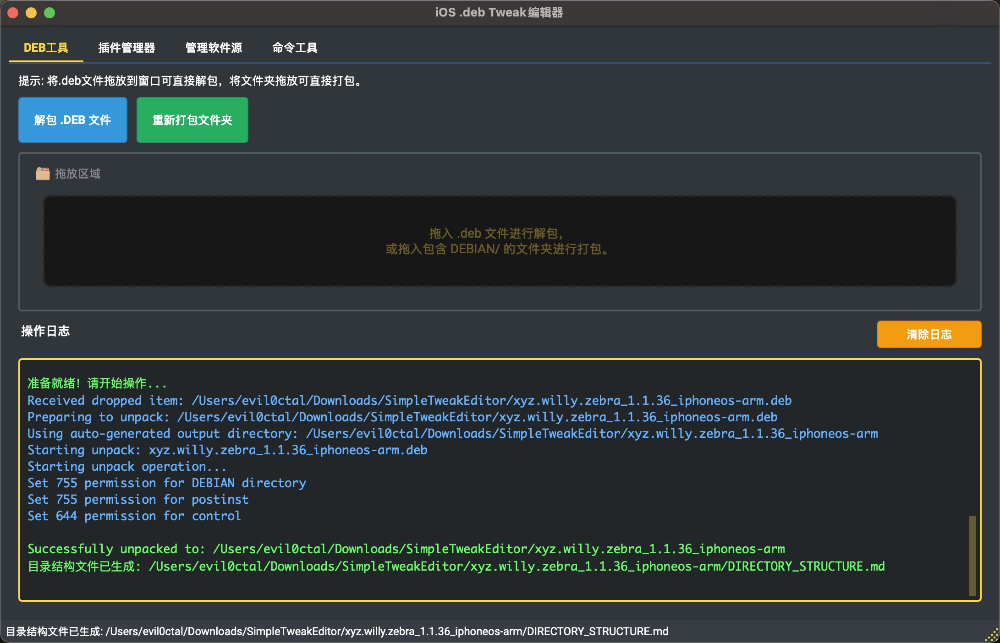
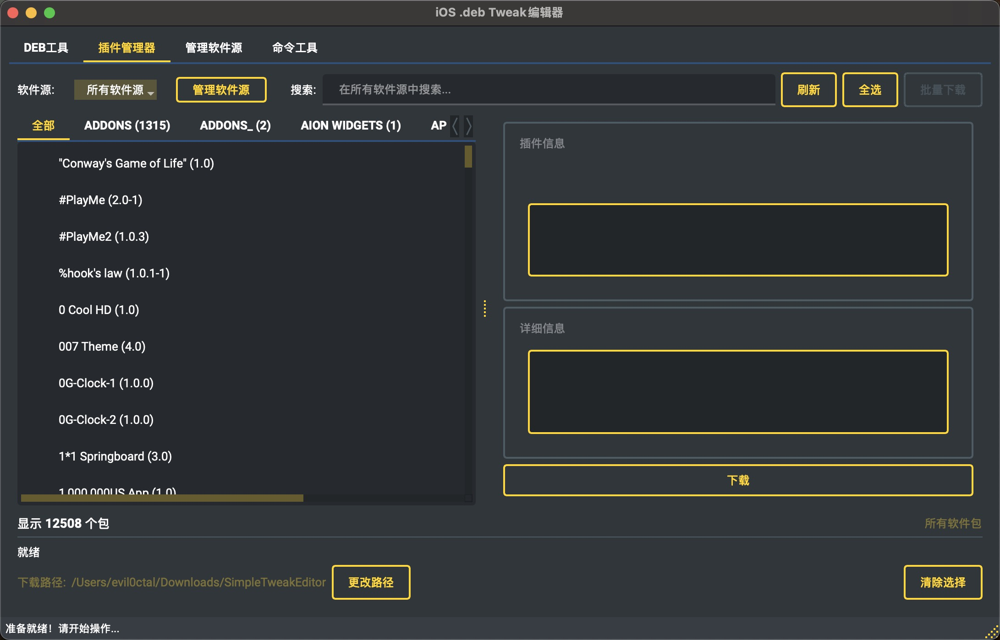
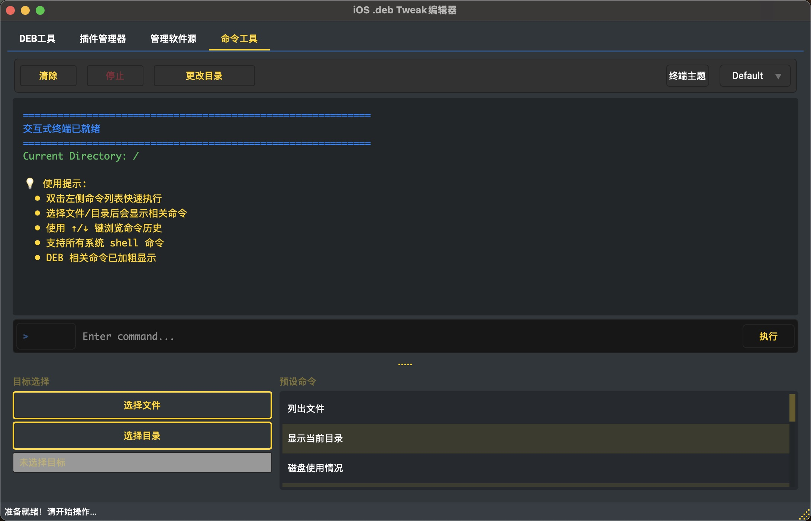
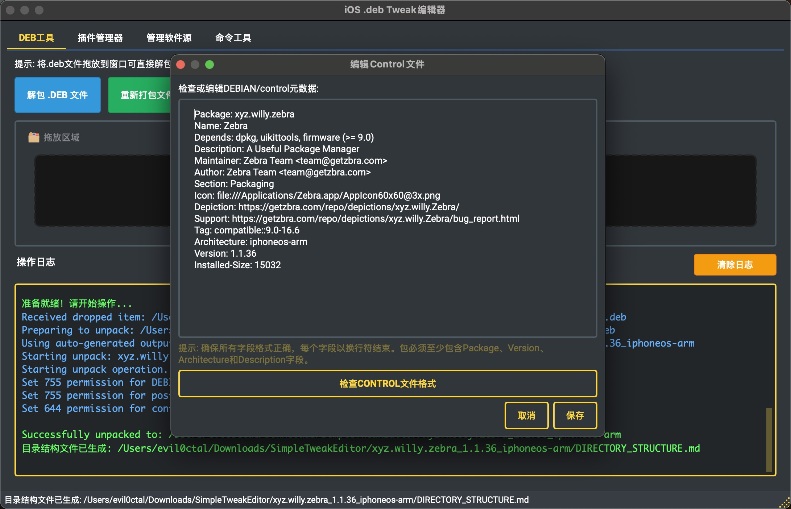
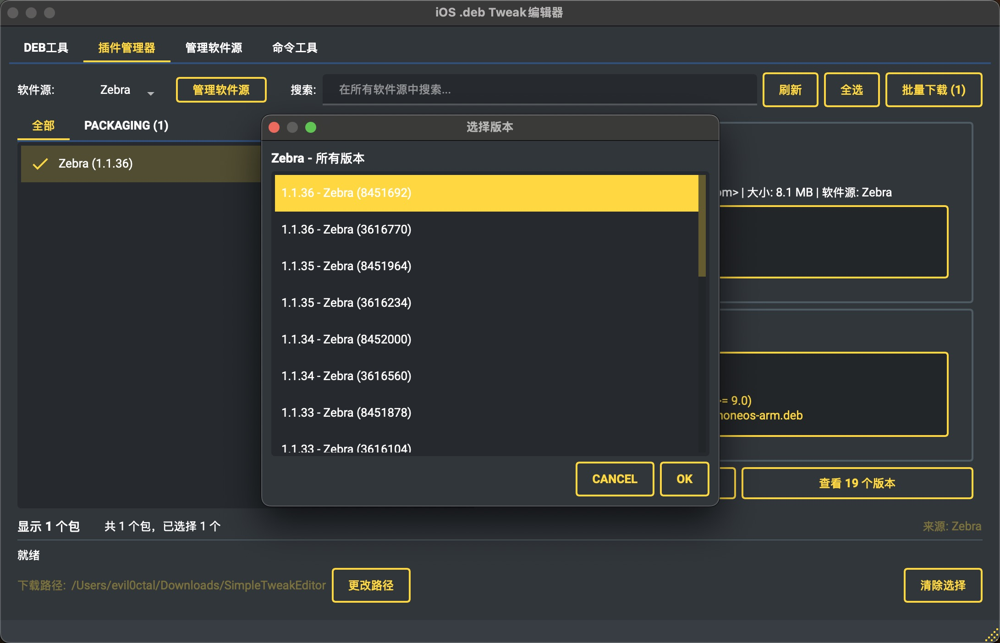
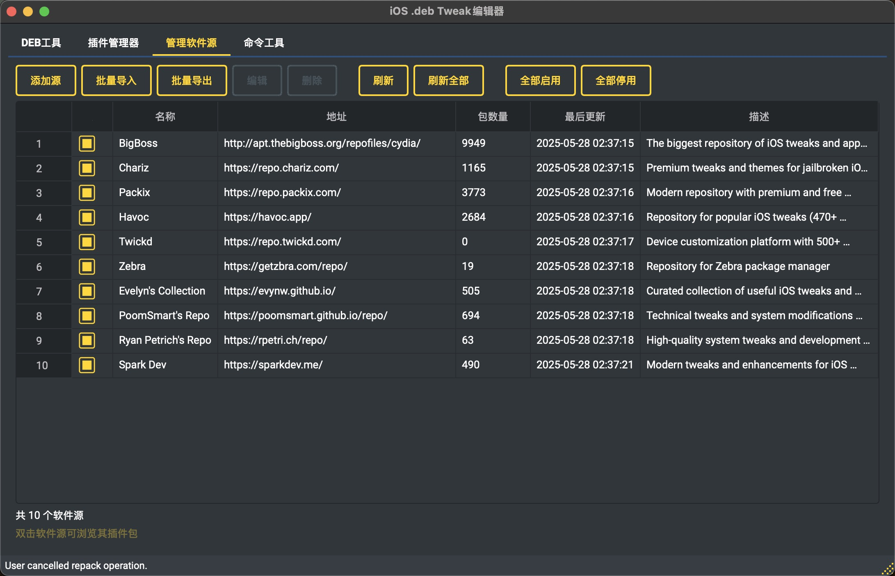

# SimpleTweakEditor

<div align="center">


[](LICENSE)
[](https://www.python.org/)
[](https://pypi.org/project/PyQt6/)
[](https://github.com/Evil0ctal/SimpleTweakEditor)
[](https://github.com/Evil0ctal/SimpleTweakEditor/stargazers)
[](https://github.com/Evil0ctal/SimpleTweakEditor/releases)
[](https://github.com/Evil0ctal/SimpleTweakEditor/releases/latest)

**Professional iOS .deb Package Editor**

[中文文档](README.md) | [Quick Start](docs/QUICK_START.md) | [Download](https://github.com/Evil0ctal/SimpleTweakEditor/releases)

</div>

## 📸 Screenshots

<div align="center">
<table>
  <tr>
    <td align="center">
      
      <br>
      <sub><b>Main Interface</b></sub>
    </td>
    <td align="center">
      
      <br>
      <sub><b>Package Manager</b></sub>
    </td>
    <td align="center">
      
      <br>
      <sub><b>Interactive Terminal</b></sub>
    </td>
  </tr>
  <tr>
    <td align="center">
      
      <br>
      <sub><b>Control File Editor</b></sub>
    </td>
    <td align="center">
      
      <br>
      <sub><b>Package Version Selection</b></sub>
    </td>
    <td align="center">
      
      <br>
      <sub><b>Repository Manager</b></sub>
    </td>
  </tr>
</table>
</div>

## ✨ Features

### 🔐 Security First
- **Path Validation** - Protection against path traversal attacks
- **File Size Limits** - Prevents resource exhaustion (500MB max)
- **Secure Operations** - Atomic file operations with proper permissions
- **Safe Configuration** - Secure permission management (0600)

### 🎯 Core Functionality
- **Unpack .deb Files** - Extract .deb packages while preserving structure
- **Repack Folders** - Build .deb packages from modified folders
- **Drag & Drop** - Simple drag and drop interface for quick operations
- **Control File Editor** - Built-in editor with syntax validation
- **Batch Processing** - Command-line support for automation
- **Package Management** - Built-in package browser and repository management
- **Interactive Terminal** - Real PTY-based terminal with multi-tab support

### 🌍 User Experience
- **Multi-language** - English/Chinese with automatic system detection
- **Multiple Themes** - Dark mode, light mode, and colorful themes
- **Dynamic Layout** - Smart layout adaptation based on screen size
- **Window Management** - Automatic window centering and state persistence
- **Smart Detection** - Automatically finds dpkg-deb in multiple paths
- **Cross-platform Fonts** - Improved font compatibility across different systems
- **Intuitive UI** - Clean, modern interface with helpful tooltips

## 🚀 Installation

### System Requirements
- **macOS**: 10.13 or later
- **Linux**: Ubuntu 18.04+ or equivalent
- **Dependencies**: dpkg-deb (for .deb operations)

### Download and Installation

#### Download Pre-built Releases
- **macOS**: 
  - **Recommended**: Download standalone version `SimpleTweakEditor.app` (includes all dependencies, ~31MB)
  - **Alternative**: Download standard `.app` or `.dmg` installer (requires Python environment)
- **Linux**: Download the corresponding executable file
- Download from [Releases](https://github.com/Evil0ctal/SimpleTweakEditor/releases)

#### Run from Source
```bash
# Clone repository
git clone https://github.com/Evil0ctal/SimpleTweakEditor.git
cd SimpleTweakEditor

# Create virtual environment
python3 -m venv venv
source venv/bin/activate  # On Windows: venv\Scripts\activate

# Install dependencies
pip install -r requirements.txt

# Install dependencies
pip install -r requirements.txt

# macOS users install dpkg
brew install dpkg

# Linux users install dpkg
sudo apt-get install dpkg

# Run application
python main.py
```

## 📖 Usage

### GUI Mode
Simply launch the application and:
1. **Drag & drop** a .deb file to unpack it
2. **Edit** the contents as needed
3. **Repack** the folder back to .deb

### Command Line Mode
```bash
# Show help
python main.py --help

# Unpack a .deb file
python main.py --unpack package.deb --output ./unpacked/

# Repack a folder
python main.py --repack ./package_folder/ --output package_new.deb

# Batch unpack
python main.py --batch --unpack "*.deb"

# Set language
python main.py --lang en  # or 'zh' for Chinese
```

## 🔨 Building the Application

### Build macOS .app

```bash
# Enter build scripts directory
cd build_scripts

# Build standalone app bundle (recommended)
# Includes all Python dependencies, users don't need Python or PyQt6
python3 build_macos_app_standalone.py

# Or build standard app bundle
# Requires Python and dependencies on user's system
python3 build_macos_app.py

# App will be created at:
# dist/SimpleTweakEditor.app
```

### Build for Linux

```bash
# Create AppImage structure
./build_scripts/build_linux_appimage.sh

# Build single file with PyInstaller
python3 build_scripts/build_release.py
```

### Build All Versions

```bash
# Auto build for all platforms
./build_scripts/prepare_release.sh

# Builds will be organized in:
# releases/v1.0.0/
#   ├── macOS/
#   │   ├── SimpleTweakEditor.app
#   │   └── SimpleTweakEditor-1.0.0-macOS.dmg
#   └── Linux/
#       └── SimpleTweakEditor-1.0.0-Linux
```

## 📚 Documentation

- [Quick Start Guide](docs/QUICK_START.md) - Get started in minutes
- [Release Notes](RELEASE_NOTES.md) - What's new in each version (Chinese)
- [Release Notes (EN)](RELEASE_NOTES_EN.md) - English release notes
- [Feature Roadmap](docs/FEATURE_ROADMAP.md) - Planned features and improvements
- [Project Structure](docs/PROJECT_STRUCTURE.md) - Understanding the codebase
- [Repository Manager Guide](docs/REPO_MANAGER_GUIDE.md) - Managing software repositories
- [Theme Documentation](docs/THEMES.md) - Theme system and customization

## 🤝 Contributing

Contributions are welcome! Please feel free to submit a Pull Request. For major changes, please open an issue first to discuss what you would like to change.

1. Fork the repository
2. Create your feature branch (`git checkout -b feature/AmazingFeature`)
3. Commit your changes (`git commit -m 'Add some AmazingFeature'`)
4. Push to the branch (`git push origin feature/AmazingFeature`)
5. Open a Pull Request

## 📋 Troubleshooting

### Common Issues

**Q: "dpkg-deb not found" error**  
A: Install dpkg using your package manager:
- macOS: `brew install dpkg`
- Ubuntu/Debian: `sudo apt-get install dpkg`

**Q: App won't open on macOS**  
A: Right-click the app and select "Open" to bypass Gatekeeper on first launch.

**Q: Missing PyQt6 error**  
A: Install Python dependencies: `pip3 install PyQt6 Pillow`

## 📝 Changelog

### v1.0.1 (2025-05-28)
- 🔧 **UI Layout Optimization** - Fixed interactive terminal component overlap and display issues
- 🌍 **Language Switching Stability** - Resolved crashes when switching languages
- 🎨 **Font Compatibility** - Improved cross-platform font handling, fixed macOS font warnings
- 📐 **Dynamic Layout** - Enhanced window size adaptation and component auto-adjustment
- 🖥️ **Terminal Improvements** - True PTY terminal support with multi-tab functionality
- 📦 **Package Management** - Built-in package browser and repository management
- 🎯 **Window Centering** - Automatic window positioning and state saving
- 🗂️ **Documentation Cleanup** - Reorganized project documentation structure

### v1.0.0 (2025-05-24)
- ✨ First official release
- 🔐 Enhanced security and path validation
- 🌍 Multi-language support with automatic system language detection
- 🎨 Multiple theme support (dark, light, colorful)
- 📦 Modular refactoring for improved code quality
- 🚀 Standalone .app build with all dependencies included
- 🔍 Smart dpkg-deb tool path detection

For detailed release notes, see [RELEASE_NOTES_EN.md](RELEASE_NOTES_EN.md)

## 📁 Project Structure

```
SimpleTweakEditor/
├── main.py                    # Main entry point
├── requirements.txt           # Python dependencies
├── README.md                 # Chinese documentation
├── README_EN.md             # This file
├── RELEASE_NOTES.md         # Release notes (Chinese)
├── RELEASE_NOTES_EN.md      # Release notes (English)
├── LICENSE                   # Apache 2.0 License
├── docs/                     # Documentation directory
│   ├── PROJECT_STRUCTURE.md  # Detailed architecture docs
│   ├── QUICK_START.md        # Quick start guide
│   ├── FEATURE_ROADMAP.md    # Feature roadmap
│   ├── REPO_MANAGER_GUIDE.md # Repository manager guide
│   └── THEMES.md             # Theme documentation
│
├── src/                      # Source code
│   ├── core/                 # Core modules
│   │   ├── app.py           # Main application logic
│   │   ├── config.py        # Configuration management
│   │   ├── events.py        # Event definitions
│   │   └── repo_manager.py  # Repository management
│   │
│   ├── ui/                   # User interface
│   │   ├── main_window.py   # Main window
│   │   ├── control_editor.py # Control file editor
│   │   ├── about_dialog_improved.py # About dialog
│   │   ├── interactive_terminal.py # Interactive terminal
│   │   ├── package_browser_dialog.py # Package browser
│   │   ├── package_manager_widget.py # Package manager
│   │   ├── repo_manager_dialog.py # Repository manager dialog
│   │   └── styles.py        # Style management
│   │
│   ├── workers/              # Background tasks
│   │   ├── command_thread.py # Command execution
│   │   └── download_thread.py # Download tasks
│   │
│   ├── utils/                # Utilities
│   │   ├── file_operations.py # File operations
│   │   └── system_utils.py  # System utilities
│   │
│   ├── localization/        # Localization
│   │   ├── language_manager.py # Language manager
│   │   └── translations.py  # Translation data
│   │
│   └── resources/           # Resources
│       └── default_repositories.json # Default repositories
│
├── build_scripts/            # Build scripts
│   ├── build_macos_app.py   # macOS standard .app build
│   ├── build_macos_app_standalone.py # macOS standalone .app build
│   ├── build_linux_appimage.sh # Linux AppImage script
│   ├── prepare_release.sh   # Release preparation script
│   └── clean_all.sh        # Clean all build files
│
└── releases/                # Release files
    └── v1.0.0/             # Version release directory
```

## 💻 Development Guide

### Code Quality
- Follows PEP 8 standards
- Type hints (coming soon)
- Comprehensive error handling
- Security-first design philosophy

### Adding New Features
1. File operations go in `utils/file_operations.py`
2. UI components go in the `ui/` directory
3. Background tasks inherit from `CommandThread` class
4. Translations go in `translations.py`

### Contributing Guidelines
1. Fork the repository
2. Create a feature branch (`git checkout -b feature/AmazingFeature`)
3. Commit your changes (`git commit -m 'Add some AmazingFeature'`)
4. Push to the branch (`git push origin feature/AmazingFeature`)
5. Create a Pull Request

## 📄 License

This project is licensed under the Apache License 2.0 - see the [LICENSE](LICENSE) file for details.

## 🙏 Acknowledgments

- PyQt6 development team
- dpkg maintainers
- All contributors

## 📞 Contact

- **Author**: Evil0ctal
- **GitHub**: https://github.com/Evil0ctal
- **Project**: https://github.com/Evil0ctal/SimpleTweakEditor

---

<div align="center">

**Note**: This tool is for legitimate iOS development and debugging purposes only. Please comply with relevant laws and regulations.

---

Made with ❤️ by [Evil0ctal](https://github.com/Evil0ctal)

⭐ Star this project if you find it helpful!

</div>